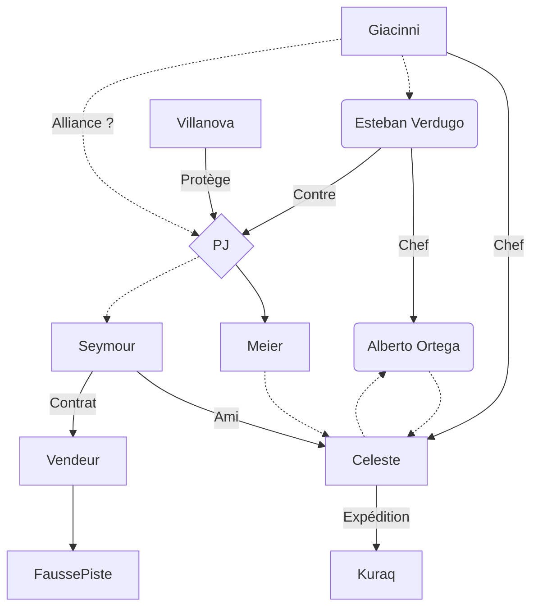

# Univers
Le concile des sorcières de Vodacce a eu une vision d’un gigantesque tremblement de terre détruisant **Serafini**. Une des sorcières de la maison Villanova a eu une vision spécifique contenant un artefact pouvant empêcher le désastre. Celui-ci ressemble à une statue de jade incrustée d'or.

Suite à un échange avec le prince **Giovanni Villanova**, celui-ci confit comme mission à la sorcière d'aller à la recherche de cet artefact.

# Joueurs
Le groupe de joueur doit être composé de :
* Une sorcière de Sorte, de la maison Villanova, proche du collège invisible,
* Un membre du collège invisible spécialisé dans les anciennes civilisations,
* Un aventurier ayant déjà voyagé dans tout Théah,
* Un garde du corps ayant une dette envers la maison Villanova,
* Un noble proche des Villanova.

# Aventure
Un des membres influents de l’église du Vaticine, **Alberto Ortega**, infiltré dans la société des explorateurs, veut détruire le collège invisible. Il a entendu parler de la reine immortelle de l’empire Kuraq, qui contrôlerait les volcans et les séismes.
Il monte une expédition en mentant sur ses objectifs à la société des explorateurs. Elle est dirigée par une montaginoise, **Celeste de Villenc**, qui se trouve être aussi un espion à la solde de la Morella Giacinni, la femme de l’empereur, qui est une ennemi déclarée de l'église Vaticine.

## Liste des scénarios :
* Tout commence à l’Universita dei Serafini, la sorcière convoque le groupe et leur explique la mission qui leur a été confiée. 
    * Une recherche dans les ressources du collége invisible permettent de trouver une statue apparente, appartenant à un membre du collège : **Lord Wójcik**.
* Etape chez un ami du collegue invisible (Lord Wójcik) :
    * Who killed Lord Wójcik : enquête sur la mort d'un noble samartien dont ils sont les commanditaires apparents ;
    * Les héros peuvent retrouver la statuette et une note d'étude du professeur **Thomas Meier** ;
    * L'étape suivante est de rencontrer le professeur **Thomas Meier**, spécialiste des artefacts du nouveau monde à l'université de Freiburg.
* Université de Freiburg : le professeur a disparu, puis les joueurs sont attaqués par des brigands.
    * Attack on Eisen : enquête sur un robot fou
* Suivre la trace des kidnappeurs, jusqu’en Montaigne et apprendre qu’il n’a pas été enlevé mais sauvé contre les troupes du Grand Inquisiteur.
    * Les héros retrouve le professeur à la cour de l'impératrice **Morella Giacinni**, qui leur propose de s'allier.
    * Twisted mirror : soirée chez l’impératrice qui tourne mal.
* Retrouver le capitaine qui a fourni le professeur : 
    * **Thomas Meier** founrni aux héros le nom de la capitaine **Celeste de Villenc**, qui opère la frégate *La Promesse* pour le compte de la société des explorateurs.
    * En se renseignant au siège de la société des explorateur, les héros peuvent apprendre qu'elle était en route pour Avalon, pour récuperer un autre membre de la société **John James Seymour** vivant dans le village de *Bryn Bresai*.
    * Ring around rosy : enquête lors d'un halte dans le village de *Bryn Bresai*.
    * The ninth eye : enquête sur une expédition a la recherche d'un artefact.
    * Pas de traces de *La Promesse*, mais les héros retrouvent le corps de **John James Seymour**. Il a sur lui une reconnaissance de dette envers un marchand d'Aragosta.
* Trouver un navire pour Aragosta, la nation pirate, pour retrouver le vendeur.
    * Op'a on board : aventure durant un trajet en bateau
    * Five sails : protection d'une auberge contre un gang vodaccien
* Retrouver le vendeur, vu pour la dernière fois lors d’une expédition au milieu de la jungle.
    * Temple of the red goddess : fausse piste sur un trésor de pirates
    * Le vendeur est mort, mais avec son carnet de voyage, les héros peuvent comprendre qu'il est parti en expedition pour l'empire de Nahuacan
    * The east is red : diplomatie en Nahuacan
* Suivre la trace de l'expédition de **Celeste de Villenc** dans les hautes montagnes de l’empire Kuraq.
* Récupérer la statue possédée par l’impératrice immortelle.
* La ramener hors de la jungle puis en bateau.
* Eviter une attaque navale de Montaigne, en fonction de leur alliance ou non avec l'impératrice **Morella Giacinni**.
* Passer l’embargo de Serafini imposé par l’église du Vaticine.

## PNJ
Nom | Fonction | Commentaires
--- | -------- | ---------
Giovanni Villanova  | Prince de Serafini |
Esteban Verdugo | Le grand inquisiteur |
Alberto Ortega | Eglise Vaticine | Infiltré dans la société des explorateurs
John James Seymour | Membre de la société des explorateurs | Avalon
Celeste de Villenc | Société des explorateurs | Espion de Morella Giacinni
Morella Giacinni | femme de l’Empereur | Souhaite démontrer que Dieux a abandonné l’église Vaticine
Thomas Meier | professeur à l’université de Freiburg | Spécialiste des artefacts

## Powermap

